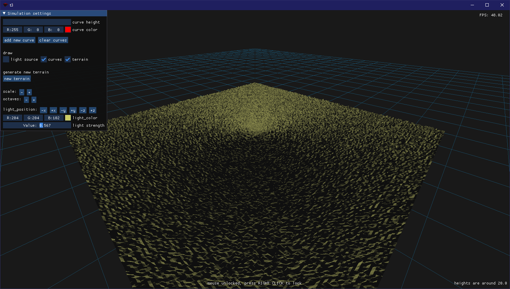
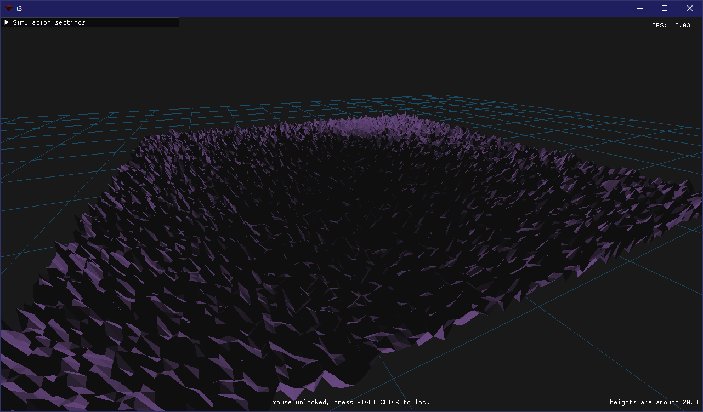
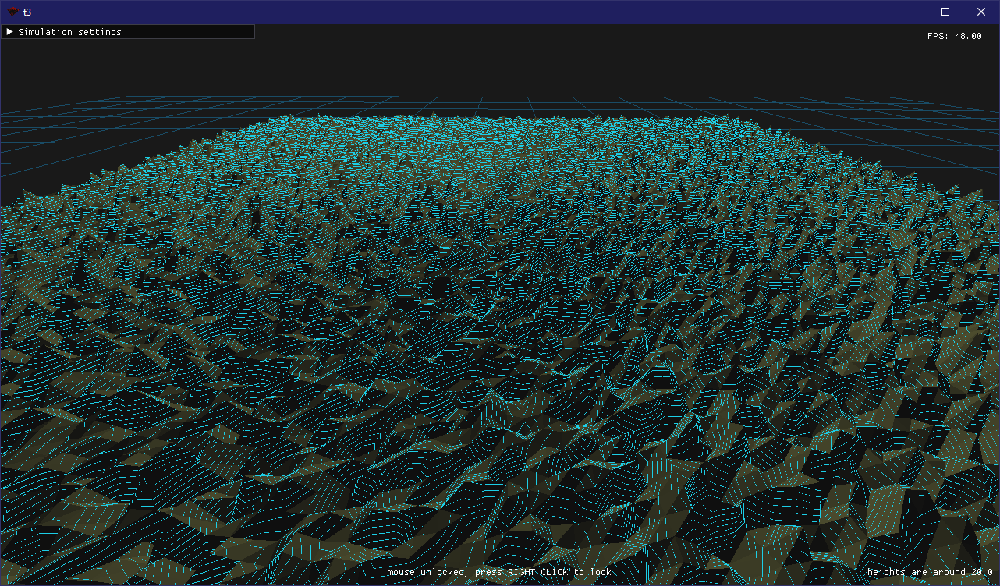
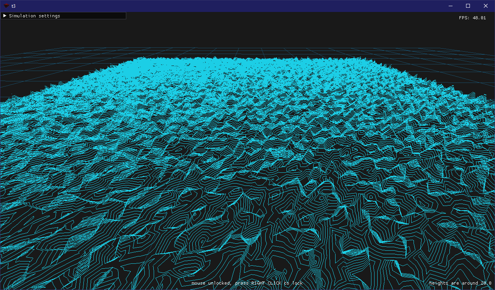

# Generación de terreno

Este proyecto es una aplicación en Python que genera y renderiza un plano de terreno procedural en 3D usando OpenGL y GLFW. Emplea ruido Perlin fractal parametrizable modelar la forma del terreno. Además del terreno, permite dibujar curvas de nivel y posee elementos de iluminación derivadas del modelo de Phong.

## Tabla de contenidos

1. [Entorno](#entorno)  
2. [Ejecución](#ejecución)  
3. [Controles](#controles)  

---

## Entorno

### 1. (opcional) Crear el entorno virtual.

```bash
python -m venv venv
```

### 2. (opcional) Activar el entorno virtual.

| **Windows (PowerShell)**                 | **Linux / macOS (Bash)**                |
|------------------------------------------|-----------------------------------------|
| `.\venv\Scripts\activate `| `source ./venv/bin/activate` |

### 3. Instalar las dependencias necesarias.

```bash
pip install -r requirements.txt
```

## Ejecución

El programa se puede ejecutar con:
```
python ./main.py <size>
```

Aquí, `size` indica el número de puntos por lado del plano: por ejemplo, un valor de 32 generará un terreno de 32×32 puntos. Ciertos ajustes, como el moviemiento de la cámara y la escala de otros elementos de la escena, dependen de este parámetro, por lo que no se recomienda usar valores demasiado pequeños. Lo recomendado es entregar valores entre 100 y 1000.

## Controles

### Interfaz Gráfica

En la esquina superior izquierda se puede desplegar un menú con opciones para controlar parámetros de la simulación o hacer cambios en esta.

### Mouse

- Con click derecho se puede desbloquear/bloquear el mouse de la ventana.
- Con click izquierdo y arrastrando con el mouse se puede mover la cámara.
- Con la rueda del mouse se puede hacer _zoom in_ y _zoom out_.

## _Preview_

### Generación de Terreno

<div style="text-align: left; margin-bottom: 25px;">
    
    
</div>

### Curvas de Nivel

<div style="text-align: left; margin-bottom: 25px;">
    
    
</div>